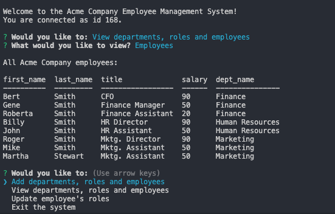

# Employee Tracker
  

  ## Description
This application provides the ability to view and manage the departments, roles, and employees in your company. Allows you to organize and plan your business. This application uses NodeJs, MySQL, NPM, and InquirerJS.

  ## Table of Contents
  * [Installation](#installation)
  * [Usage](#usage)
  * [License](#license)
  * [Contributing](#contributing)
  * [Tests](#tests)
  * [Questions](#questions)
  
  ## Installation
  In order to download necessary tools, first clone the repository. Navigate inside the project folder. If you do not have Node.js or npm installed, you will first need to install them.
  [Install Node.js and npm](https://docs.npmjs.com/downloading-and-installing-node-js-and-npm)

  ## Usage
  Create databases using the provided SQL files.

  :movie_camera: [Walkthrough video](https://drive.google.com/file/d/1DVhy0uBv1KMpC9L0SGj92L6Dccq5aHDf/view)

  :camera screenshot: 
  
  

  ## License
  Licensed under [MIT License](https://spdx.org/licenses/MIT.html).

  ## Contributing
  Anyone can participate in the project to submit bugs and make pull requests for anything from typos to new content.
  If you are interested in fixing issues and contributing to this project, please refer to the [Contributor Covenant](https://www.contributor-covenant.org/).

  ## Tests
  Currently no tests exists for the application. 
  If you would like to contribute and help us by writing them, see the [Contributing](#contributing) section.

  ## Questions
  For more information about me and my other projects, visit my [GitHub profile](https://github.com/LindseyJeeJan).
  Reach me to report issues or with questions at [ljjlauria@mac.com](mailto:ljjlauria@mac.com).
